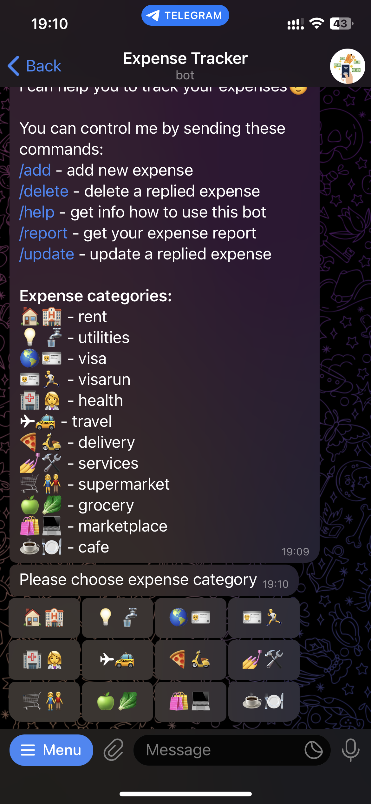

# Expense Tracker Bot

**Key Features:**

* **Expense Recording:** Users can easily input their expenses directly through Telegram, providing details such as category, currency and amount of money paid.
* **Database Integration:** The bot integrates with a database to store and organize expense data.
* **Report Generation:** Users can request reports summarizing their spending habits over specific periods. The bot compiles this information into clear and comprehensible formats, facilitating better financial insights.
* **User-Friendly Interface:** The bot is designed with a user-friendly interface, making it easy for individuals to interact with their financial data without the need for complex commands.
* **One message Flow:**  The bot updates its message at every step of the adding or updating processes and deletes all user messages instantly.

***

## Commands

* <mark style="color:blue;">/add</mark> - add new expense
* <mark style="color:blue;">/delete</mark> - delete a replied expense
* <mark style="color:blue;">/help</mark> - get info how to use this bot
* <mark style="color:blue;">/report</mark> - get your expense report
* <mark style="color:blue;">/update</mark> - update a replied expense

***

## Expense categories

| Emoji   | Category    |
| ------- | ----------- |
| 🏠🏨    | rent        |
| 💡🚰    | utilities   |
| 🌎🪪    | visa        |
| 🪪🏃    | visarun     |
| 🏥👩‍⚕️ | health      |
| ✈️🚕    | travel      |
| 🍕🛵    | delivery    |
| 💅🛠    | services    |
| 🛒👫    | supermarket |
| 🍏🥬    | grocery     |
| 🛍️💻   | marketplace |
| ☕️🍽️   | cafe        |

***

## How to Use

Add an expense

1. After the user sent the <mark style="color:blue;">/add</mark> command, the bot responds with the categories menu and prompts the user to choose the expense category.
2. The bot then updates its message with new text reflecting the option chosen in the previous step and offers a new menu to prompt the user to choose the currency.
3. The bot queries the user for the amount of money paid.
4. Finally, the message is transformed into an expense note.

   

Update an expense

1. After the user replied to an expense note by sending the <mark style="color:blue;">/update</mark> command, the bot responds with the properties menu and prompts the user to choose the property to update.
2. The bot then updates an expense note with new text prompting the user to choose an expense property.
3. The bot queries the user for new value.
4. Finally, the message with an expense note is corrected.

   

Delete an expense

1. The user replied to an expense note by sending the <mark style="color:blue;">/delete</mark> command,&#x20;
2. The bot removes it from the database and delete expense note from chat.

 

Get a report

1. After the user sent the <mark style="color:blue;">/report</mark> command, the bot responds with the reports menu and prompts the user to choose one out of four types.
2. Finally, the message is transformed into the choosen type of report.

 

